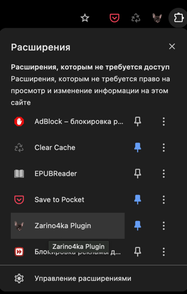

## Zarino4ka plugin

😘 👉 [Актуальный плагин](https://github.com/vse-pike/Zarino4ka-plugin/releases/latest)

---
### Что это такое?

Это плагин для моей любимой девушки - Зарины. Ты у меня его заказала и я
его сделал. 

### Что умеет

* Сортировать вкладки по группам домена
* Удалять дубликаты вкладок по домену
* Радовать пользователя Черчиллем

### Как установить

1. Скачать актуальный плагин по ссылке
2. Распаковать плагин на устройстве
3. В браузере хром перейти к управлению плагинами: `chrome://extensions/`
4. Активировать `Режим разработчика` в правом верхнем углу

5. Нажать `Загрузить распакованное расширение` в левом верхнем углу

6. В explorer найти папку с распакованным плагином, выбрать ее

Готовый к использованию плагин будет доступен в списке плагинов

